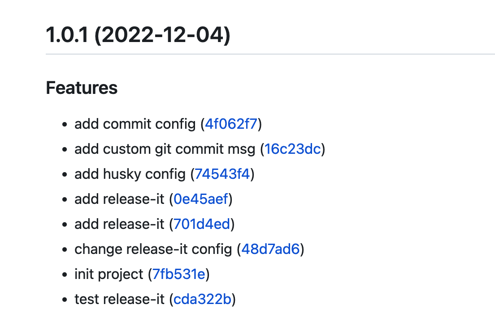

# changelog

## 项目初始化

```shell
pnpm init
```
## 安装`commitizen` 

我们在提交代码输入`commit`信息时，使用`commitizen`来检测提交的`commit`, `commitizen`会询问一些问题，它会根据开发者的回答来生成符合`Conventional Commits`标准的提交信息。

- 安装`commitizen`
```shell
pnpm install commitizen -D
```
- 初始化`Conventional Commits`规范适配器

如果是`npm`下载的用下面这条命令即可
```shell
npx commitizen init cz-conventional-changelog --save-dev --save-exact
```
使用`pnpm`操作步骤如下
1、添加依赖
```shell
pnpm add -D -E cz-conventional-changelog
```
2、添加下面的配置到`package.json`中
```json
  "config": {
    "commitizen": {
      "path": "cz-conventional-changelog"
    }
  },
```
`--save-exact(-E)`参数的意思是`精确的安装指定版本的模块`，我们会发现`dependencies`字段里模块版本号前面的`^`不见了

- 添加`scripts`命令
```json
  "scripts": {
    "commit": "cz",
  },
```
- 测试生成`commit`
```shell
ga .
pnpm run commit
```
1、选择此次提交的代码功能类型


可选项如下：
- `feat`: 新的功能
- `fix`: 修复buf
- `docs`: 只修改文档
- `style`: 不影响代码含义的修改（比如：空格、格式化、添加缺少的分号等）
- `refactor`: 重构代码（既不修复错误，也不增加功能）
- `perf`: 提高性能
- `test`: 添加测试或纠正现有测试
- `build`: 影响构建系统或外部依赖的变化（如`glup、npm`等）
- `ci`: ci配置文件和脚本的改变 （如：Travis、Circle）
- `chore`: 其它不修改src或测试文件的改动
- `revert`: 回滚之前的提交

2、接着需要指定变动的范围（如：某个组件、某个功能、某个文件等，可以跳过）


3、本次提交的简短描述


4、本次提交详细描述(可以跳过)


5、确认是否有重大变更，如果有则输入`y`回车后需要写具体地重大变更内容，如果没有则`按回车键或者输入N`


6、确认本次提交否与某个未关闭的`issue`有关联，如果有则输入`y`回车后需要填写具体影响的`issue`，如果没有则`按回车键或者输入N`


上述步骤完毕后就能生成一条`log`，我们使用`git log`命令查看


上述生成`commit`是我们手动执行`pnpm run commit`生成的，如果是团队项目，多人开发的话这样就很麻烦，不一定每个人都会遵守约定，可能会使用`git commit`来输入提交信息，所以我们要在执行`git commit`时强制执行使用规范

## 使用husky+commitlint

使用`commitlint`和`husky`来进行检查提交`commit`，执行下面的命令

- 安装`commitlint cli`以及`conventional`插件

```shell
pnpm install @commitlint/config-conventional @commitlint/cli -D
```

- 安装`husky`

```shell
pnpm install husky -D
```
- 创建`commitlint.config.js`文件，并添加以下内容：

```js
module.exports = {
  extends: ["@commitlint/config-conventional"]
}
```
- 设置在提交`commit`前，检查提交信息

激活`husky`钩子
```shell
npx husky install
```
添加`husky`的`commit-msg`钩子，在提交前对提交信息进行检查
```shell
npx husky add .husky/commit-msg 'npx --no-install commitlint --edit "$1"'
```
- 在`package.json`中添加`scripts`选项
```json
  "scripts": {
    "commit": "cz",
    "prepare": "husky install",
  },
```
添加`"prepare": "husky install"`来确保每个使用的人在使用项目前都会激活`husky`钩子。

- 检测一下

通过下图看到，现在已经可以识别到不规范的提交


## 使用`release-it`自动生成`变更日志`

- 安装`release-it`

如果是`npm`直接运行`npm init release-it`
```shell
npm init release-it
```
如果是`pnpm`按照以下步骤

1、下载依赖
```shell
pnpm install release-it -D
```
2、生成`release-it`配置

方法一：手动创建`.release-it.json文件`

方法二：执行`pnpm create release-it`命令(目前会报错)，但也会生成`.release-it.json`文件

目前项目不需要在`npm`进行发布，因此需要在`.release-it.json`中添加下面的配置，禁用npm发布：
```json
{
  "github": {
    "release": true
  },
  "npm": {
    "publish": false
  }
}
```
为了兼容当前的提交信息格式，还需要执行下面的指令安装一个插件：

```shell
pnpm install @release-it/conventional-changelog -D
```

我们可以使用`angular`默认的`changelog`生成规范
- `ignoreRecommendedBump`：我们想在自动生成版本的时候，自己来选择生成，可以配置为`true`
- `strictSemVer`：发布的版本号必须是`strict-semver`的版本号

⚠️(一定要加)：插件会自动生成`tag`，我们需要自定义一下生成`tag`时的提交信息。在配置项中加入下面的配置，来完成提交信息的自定义
```json
  "git": {
    "commitMessage": "chore(tag): release v${version}"
  },
```

更多配置参考[这里](https://github.com/release-it/conventional-changelog)

```json
{
  "github": {
    "release": true
  },
  "npm": {
    "publish": false
  },
  "plugins": {
    "@release-it/conventional-changelog": {
      "preset": "angular",
      "infile": "CHANGELOG.md",
      "ignoreRecommendedBump": true,
      "strictSemVer": true
    }
  },
  "git": {
    "commitMessage": "chore(tag): release v${version}"
  }
}
```

到`github`上查看，`CHANGELOG.md`文件和`release信息`都生成了

release信息：


`CHANGELOG.md`如下


